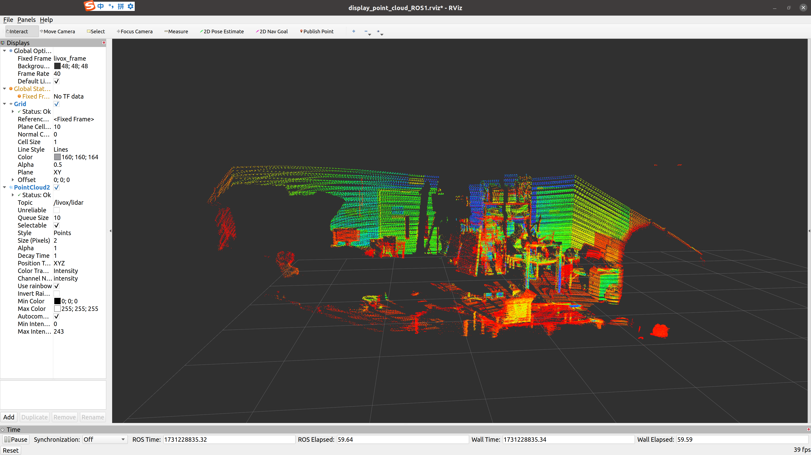

这是将Fastlio2算法部署在Livox Hap TX上的步骤。

## 0. 创建工作空间
在一个新文件夹下，假设为catkin_ws
```bash
git clone https://github.com/XC-CN/Fastlio2-in-Livox-Hap-Tx.git
```

## 1. 构建Livox SDK2 
```bash
cd livox_ws/src/Livox-SDK2 
mkdir build  
cd build  
cmake ..  
make -j$(nproc)
sudo make install  
```


## 2. 安装livox_ros_driver2
先进入livox_ros_driver2所在的文件夹位置 
```bash
cd livox_ws/src/livox_ros_driver2
```
根据ROS的版本选择不同的输入指令 
我的版本为Noetic，所以输入下列两行代码 
```bash
source /opt/ros/noetic/setup.sh
./build.sh ROS1
```

## 3. 将雷达连接上Ubuntu 

1.使用航插一分三线将雷达与电脑网口连接，并给雷达供电（需要12V）

2.为Ubuntu设置静态IP

* 在设置-网络-有线-齿轮按钮-IPV4

* IPV4方式-手动

* 地址设置为192.168.1.X，子网掩码255.255.255.0，网关192.168.1.1\
其中X为雷达的地址，在我的代码中我设置地址为192.168.1.50

* 点击应用并重启Ubuntu

3.进行雷达连接情况测试

进入livox_ros_driver2所在的文件夹
```bash
cd catkin_ws\Fastlio2-in-Livox-Hap-Tx\livox_ws\src\livox_ros_driver2
source ../../devel/setup.sh
roslaunch livox_ros_driver2 rviz_HAP.launch
```

此时应该可以看到RViz上有点云输出，确保连接成功后再进行下一步。

效果如图：



## 4. 部署Fast-LIO2 / Deploy Fast-LIO2
在fast_lio2_ws文件夹中打开终端 / Open a terminal in the fast_lio2_ws folder.
```bash
source ../livox_ws/devel/setup.bash
catkin_make -j$(nproc)
source devel/setup.bash
```

## 5. 运行代码 / Run the code
```bash
roslaunch fast_lio mapping_hap.launch
```


**运行正常的结果 / Expected output if running successfully:**


**节点图 / Node graph:**


这样，您就可以成功部署Fastlio2算法到Livox Hap TX上了 / With these steps, you can successfully deploy the Fastlio2 algorithm on the Livox Hap TX.

## 参考文章
- Livox HAP 一文搞定HAP激光雷达的连接和使用（详细版）\
https://blog.csdn.net/weixin_61985044/article/details/132405044?fromshare=blogdetail&sharetype=blogdetail&sharerId=132405044&sharerefer=PC&sharesource=XC_R6S&sharefrom=from_link